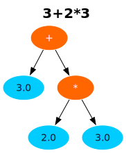
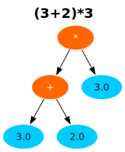

<div align="center">
    <h1>Mast</h1>
</div>

<div align="center">
    <p>
        <picture>
              <source media="(prefers-color-scheme: dark)" srcset="branding/logo_dark_export.svg">
              <source media="(prefers-color-scheme: light)" srcset="branding/logo_light_export.svg">
              
        </picture>
    </p>
    <p>
        Mast supports evaluation, simplifaction and differentiation of math
        inputs. Mast renders expressions as LaTeX or shows the abstract syntax
        tree.
    </p>
    <p>
        <picture>
            <source media="(prefers-color-scheme: dark)" srcset="docs/images/banner-dark.png">
            <source media="(prefers-color-scheme: light)" srcset="docs/images/banner-light.png">
            
        </picture>
    </p>
    <a href="https://mast.toqtou.me">
        Demo
    </a>
</div>


## Features

- **Output the AST.** A parser converts and outputs the math input into a form which the
  computer can easily handle.
- **Differentiate symbolically.** This means taking and expression and outputing
  the derivative also as an expression. For instance $x^2$ would produce
  $2\cdot x$
- **Simple simplifaction.** This means reducing parts like $x + 0$ or $1\cdot x$ into $x$.
- **Evaluating expressions.** If you have $ax^2 + bx + c$ you can input _a, b, c_ and _x_ and it will give you the value.
- **Output LaTeX.** After inputting your math you can view the ast or, if you are a human, you can also view the Latex.


## Running it locally

To run this project you need:
- [docker](https://docs.docker.com/engine/install/)
- [git](https://git-scm.com/install/windows)

To run the web app just run the folowing commands:

```bash
git clone https://github.com/fritl/mast.git
cd mast
docker build -t mast:latest .
docker run --rm -p 80:8000 mast:latest
```
Then just open [http://localhost](http://localhost)

>[!WARNING]
>For a long time I named image files for the documentation `(3+2)*3.svg` and `3+2*3.svg`.
>As it turns out Windows doesn't allow any `*` in filenames and I didn't
>realise this until recently which is why by default you can't checkout most of
>the commits in this repo if you are on windows. If you still want to check
>them out you can run `git config core.protectNTFS false`. This will allow you
>to check out the commits without creating the badly named files

## How it works

The processing follows three steps:
1. **Lexing.** In this part the computer converts the input into tokens. While this is not strictly necessary it really helps with the next step because it gets rid of whitespace.
2. **Parsing.** Specifically I used the _Recursive Descent_ parser. This converts the tokens of the previous step into an abstract syntax tree. This tree is useful because it handles precedence and you can work really well with it.

<picture>
      <source media="(prefers-color-scheme: dark)" srcset="./docs/images/mast_example_1_light.svg">
      <source media="(prefers-color-scheme: light)" srcset="./docs/images/mast_example_1_dark.svg">
      
</picture>
<picture>
      <source media="(prefers-color-scheme: dark)" srcset="./docs/images/mast_example_2_light.svg">
      <source media="(prefers-color-scheme: light)" srcset="./docs/images/mast_example_2_dark.svg">
      
</picture>

3. **Manipulating the AST.** Once you have parsed the input you can do a lots of actions like simplifying, differentiating or evaluating on the ast

This process is also a big part of what compilers do. Of course there is much more to writing a compiler than to a mat pareser but I think I still got a good understanding on how you could write a compiler.

## What I have not done

You could go on and do much more with the ast. Just to name a few:
- Improve simplification to also simplify e.g. $3x + 2x \to 5x$
- Check two expressions for equality. This sounds simple but if you want to compare $(x+1)^2 = x^2 + 2x + 1$ you need to find some standardized form which is really difficult.
- Improve input. You currently cannot input $3(x + 2)$ because it is too hard to differentiate between 3 beeing a simple number and 3 beeing a function call like $sin(x)$
